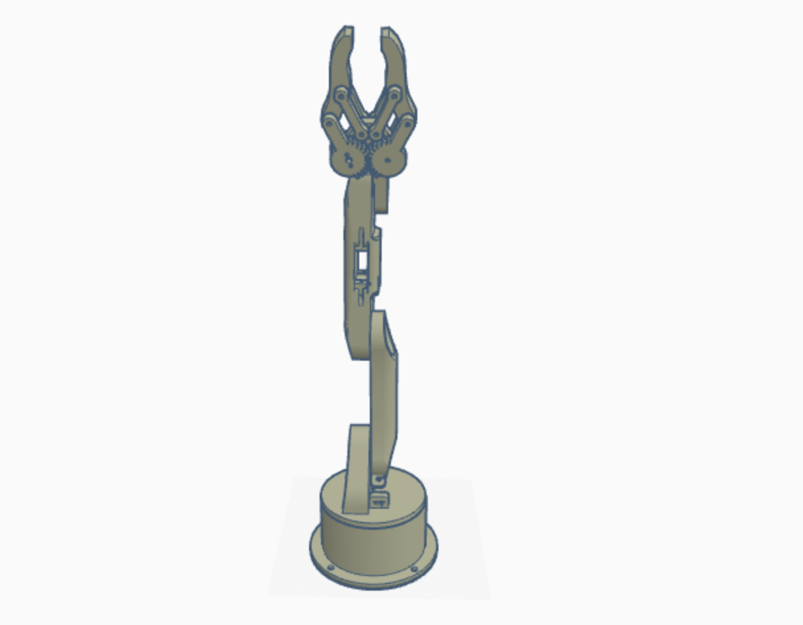

# Robot_Arm_Assambly

## Discription

this project was an assembly of smart methods [arm robot](https://github.com/smart-methods/arduino_robot_arm)

## Simulation

## Steps 

1. start with the base and put it on a flat surface
2. put the Waist on top of the base 
3. put the arm 01 in a 90 degree angle of waist
4. put the arm 02 in a 90 degree angle of arm 01
5. put the gripper in a 90 degree angle of arm 02
